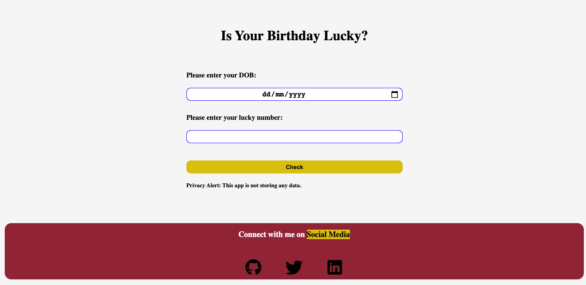
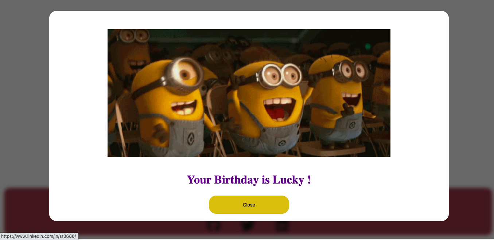
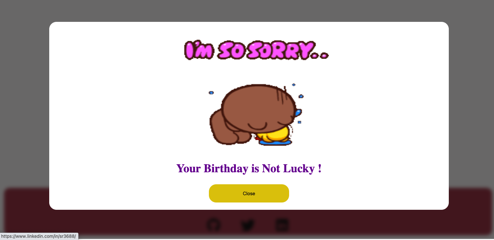

# Is your birthday lucky?

This program has two varients one is a CLI app that you can find in the CLI folder and the other one is the web app made with the HTML CSS and VannilaJS. This app takes two inputs which are explained below:

#### Try it Live: [Go to the project](http://is-your-birthday-lucky-01.netlify.app)

### i) User Birthday
    
User has to put in the his/her birthday in the format DDMMYYYY for ex: 11121997 where 11 is the day 12 is the month and 1997 is the year.

### ii) User Lucky Number

User has to put in the lucky number here.

## How the program works(Logic)?
   
Well, it takes two inputs as mentioned above and checks if the sum of the DOB is divisible by the lucky number.
    
## Result 

As a result if the DOB is divisible by the lucky number then the program shows the output "Congratulations ! Your Birthday is Lucky" else shows "Sorry ! Your birthday is not lucky"

## Testing

       For testing you can put the values mentioned below:

       For Being the user Lucky:

       DOB: 11/12/1997
       Lucky Number: 31

       For Being the user unlucky:

       DOB: 11/12/1997
       Lucky Number: 30

## Screenshot 👇

